# PasteMD
<p align="center">
  
</p>

<p align="center">
  <a href="https://github.com/RICHQAQ/PasteMD/releases">
    
  </a>
  <a href="https://github.com/RICHQAQ/PasteMD/releases">
    
  </a>
  <a href="LICENSE">
    
  </a>
  
  
</p>

<p align="center"> 
  <a href="docs/md/README.en.md">English</a>
  |
  <a href="README.md">简体中文</a>
  |
  <a href="docs/md/README.ja.md">日本語</a>
</p>

> 在写论文或报告时，从 ChatGPT / DeepSeek 等 AI 网站中复制出来的公式在 Word 里总是乱码？Markdown 表格复制到 Excel 总是不行？**PasteMD 就是为了解决这个问题而生的，嘿嘿**
> 
> 

一个常驻托盘的小工具：
从 **剪贴板读取 Markdown**，调用 **Pandoc** 转换为 DOCX，并自动插入到 **Word/WPS** 光标位置。

**✨ 功能**：智能识别 Markdown 表格，一键粘贴到 **Excel**！

**✨ 功能**：智能识别 HTML富文本，方便直接复制网页上的ai回复，一键粘贴到 **Word/WPS**！

**✨ 新功能**：应用扩展（HTML+Markdown/HTML/Markdown/LaTeX/文件粘贴），可按应用/窗口标题匹配（如语雀/QQ等）。

**✨ 新功能**：转换增强：支持按转换类型配置 Pandoc Filters；自动修复部分 LaTeX 语法与单 `$...$` 公式块。

---

## 功能特点

### 演示效果

#### Markdown → Word/WPS

<p align="center">
  
</p>

#### 复制网页中的ai回复 → Word/WPS
<p align="center">
  
</p>

#### Markdown 表格 → Excel
<p align="center">
  
</p>

#### 设置格式
<p align="center">
  
</p>


* 全局热键（默认 `Ctrl+Shift+B`）一键粘贴 Markdown → DOCX。
* **✨ 智能识别 Markdown 表格**，自动粘贴到 Excel。
* **✨ 应用扩展**：为不同应用配置 HTML+Markdown/HTML/Markdown/LaTeX/文件 粘贴模式，支持按窗口标题匹配。
* **✨ 转换增强**：按转换类型添加 Pandoc Filters，自动修复部分 LaTeX 语法与单 `$...$` 公式块。
* 自动识别当前前台应用：Word 或 WPS。
* 智能打开所需应用为Word/Excel。
* 托盘菜单，可保留文件、查看日志/配置等。
* 支持系统通知提醒。
* 无黑框，无阻塞，稳定运行。

---

## 📊 AI 网站兼容性测试

以下是主流 AI 对话网站的复制粘贴兼容性测试结果：

| AI 网站 | 复制 Markdown<br/>（无公式） | 复制 Markdown<br/>（含公式） | 复制网页内容<br/>（无公式） | 复制网页内容<br/>（含公式） |
|---------|:----------------------------:|:----------------------------:|:---------------------------:|:---------------------------:|
| **Kimi** | ✅ 完美支持 | ✅ 完美支持 | ✅ 完美支持 | ⚠️ 无法显示公式 |
| **DeepSeek** | ✅ 完美支持 | ✅ 完美支持 | ✅ 完美支持 | ✅ 完美支持 |
| **通义千问** | ✅ 完美支持 | ✅ 完美支持 | ✅ 完美支持 | ⚠️ 无法显示公式 |
| **豆包\*** | ✅ 完美支持 | ✅ 完美支持 | ✅ 完美支持 | ✅ 完美支持 |
| **智谱清言<br/>/ChatGLM** | ✅ 完美支持 | ✅ 完美支持 | ✅ 完美支持 | ✅ 完美支持 |
| **ChatGPT** | ✅ 完美支持 | ⚠️ 公式显示为代码 | ✅ 完美支持 | ✅ 完美支持 |
| **Gemini** | ✅ 完美支持 | ✅ 完美支持 | ✅ 完美支持 | ✅ 完美支持 |
| **Grok** | ✅ 完美支持 | ✅ 完美支持 | ✅ 完美支持 | ✅ 完美支持 |
| **Claude** | ✅ 完美支持 | ✅ 完美支持 | ✅ 完美支持 | ✅ 完美支持 |

**图例说明：**
- ✅ **完美支持**：格式、样式、公式会均正确显示
- ⚠️ **公式显示为代码**：数学公式会以 LaTeX 代码形式显示，需在 Word/WPS 中手动使用公式编辑器
- ⚠️ **无法显示公式**：数学公式会丢失，需在 Word/WPS 中手动使用公式编辑器，自行输入公式内容
- **豆包**：复制网页内容（含公式）前，需要在浏览器中开启“允许读取剪贴板”权限，可在 URL 地址栏左侧的图标中进行设置

**测试说明：**
1. **复制 Markdown**：点击 AI 回复中的"复制"按钮（通常复制的是 Markdown 格式，但是部分网站也会携带上html）
2. **复制网页内容**：直接选中 AI 回复内容进行复制（复制的是 HTML 富文本）

---

## 🚀使用方法

1. 下载可执行文件（[Releases 页面](https://github.com/RICHQAQ/PasteMD/releases/)）：

   * ~~**PasteMD\_vx.x.x.exe**：**便携版**，需要你本机已经安装好 **Pandoc** 并能在命令行运行。
   若未安装，请到 [Pandoc 官网](https://pandoc.org/installing.html) 下载安装即可。~~ （不再提供，需要请自行编译）
   * **PasteMD\_pandoc-Setup.exe**：**一体化安装包**，自带 Pandoc，不需要另外配置环境。

2. 打开 Word、WPS 或 Excel，光标放在需要插入的位置。

3. 复制 **Markdown** 或者 **网页内容** 到剪贴板，按下热键 **Ctrl+Shift+B**。

4. 转换结果会自动插入到文档中：
   - **Markdown 表格** → 自动粘贴到 Excel（如果 Excel 已打开）
   - **普通 Markdown**/**网页内容** → 转换为 DOCX 并插入 Word/WPS

5. 右下角会提示成功/失败。

---

## ⚙️配置

首次运行会在用户数据目录生成 `config.json`（Windows：`%APPDATA%\\PasteMD\\config.json`， MacOS: `~/Library/Application Support/PasteMD/config.json`），可手动编辑：

```json
{
  "hotkey": "<ctrl>+<shift>+b",
  "pandoc_path": "pandoc",
  "reference_docx": null,
  "save_dir": "%USERPROFILE%\\Documents\\pastemd",
  "keep_file": false,
  "notify": true,
  "startup_notify": true,
  "enable_excel": true,
  "excel_keep_format": true,
  "paste_delay_s": 0.3,
  "no_app_action": "open",
  "md_disable_first_para_indent": true,
  "html_disable_first_para_indent": true,
  "html_formatting": {
    "strikethrough_to_del": true
  },
  "move_cursor_to_end": true,
  "Keep_original_formula": false,
  "enable_latex_replacements": true,
  "fix_single_dollar_block": true,
  "language": "zh-CN",
  "pandoc_request_headers": [
    "User-Agent: Mozilla/5.0 (Windows NT 10.0; Win64; x64) AppleWebKit/537.36 (KHTML, like Gecko) Chrome/120.0.0.0 Safari/537.36"
  ],
  "pandoc_filters": [],
  "pandoc_filters_by_conversion": {
    "md_to_docx": [],
    "html_to_docx": [],
    "html_to_md": [],
    "md_to_html": [],
    "md_to_rtf": [],
    "md_to_latex": []
  },
  "extensible_workflows": {
    "html": {
      "enabled": true,
      "apps": [],
      "keep_formula_latex": true
    },
    "md": {
      "enabled": true,
      "apps": [],
      "html_formatting": {
        "css_font_to_semantic": true,
        "bold_first_row_to_header": true
      }
    },
    "latex": {
      "enabled": true,
      "apps": []
    },
    "file": {
      "enabled": true,
      "apps": []
    }
  }
}
```

字段说明：

* `hotkey`：全局热键，语法如 `<ctrl>+<alt>+v`。
* `pandoc_path`：Pandoc 可执行文件路径。
* `reference_docx`：Pandoc 参考模板（可选）。
* `save_dir`：保留文件时的保存目录。
* `keep_file`：是否保留生成的 DOCX 文件。
* `notify`：是否显示系统通知。
* `startup_notify`：启动时是否显示提示通知。
* **`enable_excel`**： - 是否启用智能识别 Markdown 表格并粘贴到 Excel（默认 true）。
* **`excel_keep_format`**： - Excel 粘贴时是否保留 Markdown 格式（粗体、斜体、代码等），默认 true。
* `paste_delay_s`：粘贴前的延迟秒数（win有的时候写入剪切板需要一点点时间）。
* **`no_app_action`**： 当未检测到目标应用（如 Word/Excel）时的默认动作（默认 `"open"`）。可选值：`open`=自动打开、`save`=仅保存、`clipboard`=复制文件到剪贴板、`none`=无操作。
* **`md_disable_first_para_indent`**： - Markdown 转换时是否禁用第一段的特殊格式，统一为正文样式（默认 true）。
* **`html_formatting`**： - HTML 富文本转换时的格式化选项。
  * **`strikethrough_to_del`**： - 是否将删除线 ~~ 转换为 `<del>` 标签，使得转换正确（默认 true）。
* **`html_disable_first_para_indent`**： - HTML 富文本转换时是否禁用第一段的特殊格式，统一为正文样式（默认 true）。
* **`move_cursor_to_end`**： - 插入内容后是否将光标移动到插入内容的末尾（默认 true）。
* **`Keep_original_formula`**： - 是否保留原始数学公式（LaTeX 代码形式）。
* `enable_latex_replacements`：自动修复部分不兼容的 LaTeX 语法（例如将 `{\\kern 10pt}` 替换为 `\\qquad`）。
* `fix_single_dollar_block`：自动识别并修复单独一行的 `$ ... $` 公式块（转换为 `$$ ... $$`）。
* `language`：界面语言，`zh-CN` 简体中文，`en-US` 英文，`ja-JP` 日语。
* `pandoc_request_headers`：Pandoc 下载远程资源时附加的请求头（每行一个 `Header: Value`）。
* **`pandoc_filters`**： - 自定义 Pandoc Filter 列表。可添加 `.lua` 脚本或可执行文件路径，Filter 将按照列表顺序依次执行。用于扩展 Pandoc 转换功能，如自定义格式处理、特殊语法转换等。默认为空列表。示例：`["%APPDATA%\\npm\\mermaid-filter.cmd"]` 可实现 Mermaid 图表支持。
* `pandoc_filters_by_conversion`：按转换类型配置 Filters（如 `md_to_docx`、`html_to_md` 等）。
* `extensible_workflows`：应用扩展配置（按应用/窗口标题匹配不同粘贴模式），详情见下文。

修改后可在托盘菜单选择 **“重载配置/热键”** 立即生效。

---

## 🔧 高级功能：自定义 Pandoc Filters

### 什么是 Pandoc Filter？

Pandoc Filter 是在文档转换过程中对内容进行自定义处理的插件程序。PasteMD 支持配置多个 Filter，按顺序依次处理文档内容，实现扩展功能。

### 使用场景示例：Mermaid 图表支持

如果您想在 Markdown 中使用 Mermaid 图表并正确转换到 Word，可以使用 [mermaid-filter](https://github.com/raghur/mermaid-filter)。

**1. 安装 mermaid-filter**

```bash
npm install --global mermaid-filter
```

*前置条件：需要先安装 [Node.js](https://nodejs.org/)*

<details>
<summary>⚠️ <b>故障排除：Chrome 下载失败</b></summary>

安装 mermaid-filter 时需要下载 Chromium 浏览器。如果自动下载失败，可以手动下载：

**步骤 1：查找所需的 Chromium 版本号**

查看文件：`%APPDATA%\npm\node_modules\mermaid-filter\node_modules\puppeteer-core\lib\cjs\puppeteer\revisions.d.ts`

找到类似以下内容：
```typescript
chromium: "1108766";
```

或在报错信息里，如：
```bash
npm error Error: Download failed: server returned code 502. URL: https://npmmirror.com/mirrors/chromium-browser-snapshots/Win_x64/1108766/chrome-win.zip
```
找到类似 `Win_x64/1108766` 的版本号。

记下这个版本号（例如：`1108766`）。

**步骤 2：下载 Chromium**

根据上一步获取的版本号，下载对应的 Chromium：

```
https://storage.googleapis.com/chromium-browser-snapshots/Win_x64/1108766/chrome-win.zip
```

（将 URL 中的 `1108766` 替换为你查到的版本号）

**步骤 3：解压到指定目录**

将下载的 `chrome-win.zip` 解压到以下目录：

```
%USERPROFILE%\.cache\puppeteer\chrome\win64-1108766\chrome-win
```

（目录中的 `1108766` 也需要替换为你的版本号）

解压后，应该有 `chrome.exe` 位于：  
`%USERPROFILE%\.cache\puppeteer\chrome\win64-1108766\chrome-win\chrome.exe`

</details>

**2. 配置到 PasteMD**

方式一：通过设置界面
- 打开 PasteMD 设置 → 转换选项卡 → Pandoc Filters
- 点击「添加...」按钮
- 选择 Filter 文件：`%APPDATA%\npm\mermaid-filter.cmd`
- 保存设置

方式二：编辑配置文件
```json
{
  "pandoc_filters": [
    "%APPDATA%\\npm\\mermaid-filter.cmd"
  ]
}
```

**3. 测试效果**

复制以下 Markdown 内容并使用 PasteMD 转换：

~~~markdown

```mermaid
graph LR
    A[开始] --> B[处理]
    B --> C[结束]
```

~~~

Mermaid 图表将被渲染为图片并插入到 Word 文档中。

### 更多 Filter 资源

- [Pandoc Filters 官方列表](https://github.com/jgm/pandoc/wiki/Pandoc-Filters)
- [Lua Filters 文档](https://pandoc.org/lua-filters.html)

---

## 🧩 应用扩展（自定义粘贴工作流）

设置 → **应用扩展** 中可以为不同应用配置粘贴模式，支持按窗口标题正则匹配：

* **HTML** / **Markdown** / **LaTeX** / **文件**：按目标应用选择最合适的粘贴方式
  - HTML、Markdown 适合语雀等富文本笔记软件
  - LaTeX 适合overleaf等学术网站
  - 文件 适合QQ、微信等作为附件粘贴的应用

> 提示：同一个应用只建议配置一种工作流（避免冲突）；需要区分窗口标题时可使用“窗口名称匹配”。

示例配置（节选）：

> Windows 下 `id` 通常为应用的 exe 路径；macOS 为应用的 bundle id（建议通过设置界面添加，自动填充）。

```json
{
  "extensible_workflows": {
    "html": {
      "enabled": true,
      "apps": [
        {
          "name": "语雀",
          "id": "/path/语雀.exe",
          "window_patterns": []
        }
      ],
      "keep_formula_latex": true
    },
    "latex": {
      "enabled": true,
      "apps": [
        {
          "name": "chrome",
          "id": "/path/chrome.exe",
          "window_patterns": [
            ".*overleaf.*"
          ]
        }
      ]
    },
    "file": {
      "enabled": true,
      "apps": [
        {
          "name": "QQ",
          "id": "/path/qq.exe",
          "window_patterns": []
        }
      ]
    }
  }
}
```

---

## 托盘菜单

* 快捷显示：当前全局热键（只读）。
* 启用热键：开/关全局热键。
* 弹窗通知：开/关系统通知。
* 无应用时动作：当未检测到 Word/WPS/Excel 时的默认动作（自动打开/仅保存/复制到剪贴板/无操作）。
* 插入后移动光标到末尾：插入内容后是否将光标移动到插入内容的末尾。
* HTML 格式化：切换 **删除线 ~~ 转换为 `<del>`** 等 HTML 自动整理，使得可以正确转换（防止部分网页没有解析这些格式，导致从网页复制粘贴无法显示这些格式）。
* 设置热键：通过图形界面录制并保存新的全局热键（即时生效）。
* 保留生成文件：勾选后生成的 DOCX 会保存在 `save_dir`。
* 打开保存目录、查看日志、编辑配置、重载配置/热键。
* 版本：显示当前版本；可检查更新；若检测到新版本，会显示条目并可点击打开下载页面。
* 退出：退出程序。

---

## 📦从源码运行 / 打包

建议 Python 3.12 (64位)。

```bash
pip install -r requirements.txt
python main.py
```

使用 PyInstaller：

```bash
pyinstaller --clean -F -w -n PasteMD
  --icon assets\icons\logo.ico
  --add-data "assets\icons;assets\icons"
  --add-data "pastemd\i18n\locales\*.json;pastemd\i18n\locales"
  --add-data "pastemd\lua;pastemd\lua"
  --hidden-import plyer.platforms.win.notification
  main.py
```

生成的程序在 `dist/PasteMD.exe`。

---

## ⭐ Star 

感谢每一位 Star 的帮助，欢迎分享给更多小伙伴~，想要达成4096 star🌟，我会努力的喵


[](https://www.star-history.com/#RICHQAQ/PasteMD&type=date&legend=top-left)

## 🍵支持与打赏

如果有什么想法和好建议，欢迎issue交流！🤯🤯🤯


也欢迎加入 **PasteMD使用交流群** 与其他用户交流：
<div align="center">
  
  <br>
  <sub>扫码加入PasteMD QQ交流群</sub>
</div>

希望这个小工具对你有帮助，欢迎请作者👻喝杯咖啡☕～你的支持会让我更有动力持续修复问题、完善功能、适配更多场景并保持长期维护。感谢每一份支持！


     
| 支付宝 | 微信 |
| --- | --- |
|  |  |


---

## License

This project is licensed under the [MIT License](LICENSE).
Third-party licenses are listed in [THIRD_PARTY_NOTICES.md](THIRD_PARTY_NOTICES.md).
