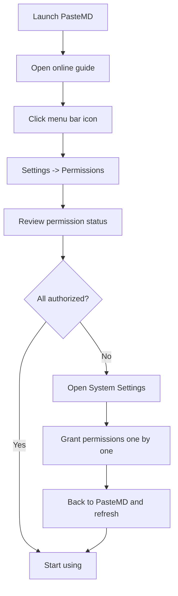

# macOS Permissions

macOS security requires explicit user authorization before an app can access certain system capabilities. PasteMD needs the following permissions to work properly.

::: warning Important
**All permissions must be granted**, otherwise related features will not work.
:::

## Quick Check

### Check in Settings UI

1. Click the PasteMD menu bar icon
2. Select "Settings"
3. Switch to the "Permissions" tab
4. Review each permission status
5. Click "Open System Settings" to jump directly

### Check in System Settings

Open "System Settings" -> "Privacy & Security" and check:

- ✅ Accessibility
- ✅ Screen Recording (macOS 10.15+)
- ✅ Input Monitoring
- ✅ Automation

## Permission Details

### 1. Accessibility (Accessibility)

<div class="info-card">
  <div class="info-card-icon">⌨️</div>
  <div class="info-card-content">
    <h4>Purpose</h4>
    <p>Simulate keyboard input for WPS auto paste (Cmd+V)</p>
  </div>
</div>

**Required**: ⚠️ **Conditionally required** - required if you use WPS; not required if you only use Office

**Setup steps**:

1. Open "System Settings" -> "Privacy & Security"
2. Click "Accessibility"
3. Click the lock icon 🔒 to unlock (password required)
4. Find "PasteMD" and check it
5. If PasteMD is missing, click ➕ to add it:
   - Press `Cmd+Shift+G` in Finder to open "Go to Folder"
   - Enter `/Applications/PasteMD.app`
   - Click "Open"
6. Restart PasteMD

**Verify**:
- Open WPS Writer or WPS Spreadsheet
- Copy a Markdown snippet
- Press the hotkey `Ctrl+Shift+B`
- Content should paste into WPS automatically

---

### 2. Screen Recording (Screen Recording)

<div class="info-card">
  <div class="info-card-icon">🖥️</div>
  <div class="info-card-content">
    <h4>Purpose</h4>
    <p>Detect foreground window and app name (Word/Excel/WPS)</p>
  </div>
</div>

**Required**: ✅ **Required** (macOS 10.15+) - without it, app detection will not work

**Supported systems**: macOS 10.15 Catalina and above

**Setup steps**:

1. Open "System Settings" -> "Privacy & Security"
2. Click "Screen Recording"
3. Click the lock icon 🔒 to unlock
4. Find "PasteMD" and check it
5. Click "Later" or "Quit Now" (recommended: quit and restart)

::: tip Note
Although called "Screen Recording", PasteMD **does not record your screen**. It only reads window information.
:::

**Verify**:
- Open Word or Excel
- Check PasteMD logs (menu bar -> "View Logs")
- You should see the detected app name

---

### 3. Input Monitoring (Input Monitoring)

<div class="info-card">
  <div class="info-card-icon">⌨️</div>
  <div class="info-card-content">
    <h4>Purpose</h4>
    <p>Listen to global hotkeys such as Ctrl+Shift+B</p>
  </div>
</div>

**Required**: ✅ **Required** - without it, hotkeys will not work

**Setup steps**:

1. Open "System Settings" -> "Privacy & Security"
2. Click "Input Monitoring"
3. Click the lock icon 🔒 to unlock
4. Find "PasteMD" and check it
5. Restart PasteMD

**Verify**:
- Open any app
- Press the hotkey `Ctrl+Shift+B`
- If a notification appears, the permission works

---

### 4. Automation (Automation)

<div class="info-card">
  <div class="info-card-icon">🤖</div>
  <div class="info-card-content">
    <h4>Purpose</h4>
    <p>Control Microsoft Word/Excel via AppleScript for precise insertion</p>
  </div>
</div>

**Required**: ⚠️ **Conditionally required** - required if you use Office; not required if you only use WPS

**Setup steps**:

1. Open "System Settings" -> "Privacy & Security"
2. Click "Automation"
3. Find "PasteMD" and expand it
4. Check the following (only appears after first use):
   - ✅ Microsoft Word
   - ✅ Microsoft Excel

::: tip First trigger
This permission usually appears when you **first insert content into Word/Excel**. If you clicked "Don't Allow", enable it manually in System Settings.
:::

**Verify**:
- Open Microsoft Word
- Copy a Markdown snippet
- Press the hotkey `Ctrl+Shift+B`
- Content should insert at the caret

---

## Authorization Workflow

### First Launch Flow



### Recommended Order

Grant permissions in this order:

1. **Input Monitoring** - most important; hotkeys must work
2. **Screen Recording** - next; app detection
3. **Accessibility** - only if using WPS
4. **Automation** - triggered when inserting into Office

## FAQ

### Authorized but still not working

**Fixes**:

1. **Quit PasteMD completely**:
   - Menu bar icon -> "Quit"
   - Or force quit in Activity Monitor

2. **Restart PasteMD**:
   - Launch from Applications
   - Or from Launchpad

3. **Refresh permission status**:
   - Settings -> Permissions -> "Refresh"

4. **Check System Settings**:
   - Make sure PasteMD is checked

### PasteMD not listed

PasteMD does not appear in the permission list.

**Fixes**:

1. **Make sure PasteMD has run**: the list only shows apps that requested permissions
2. **Trigger a permission request**:
   - Launch PasteMD
   - Try to use the feature (press hotkey)
   - macOS will prompt for authorization
3. **Manual add** (only for some permissions):
   - System Settings -> Privacy & Security -> target permission
   - Click the ➕ button
   - Select `/Applications/PasteMD.app`

## Security Notes

### How PasteMD uses permissions

- **Accessibility**: only simulates `Cmd+V`, does not record keystrokes
- **Screen Recording**: only reads window info (app name and window title), no screenshots or recordings
- **Input Monitoring**: only listens to your configured hotkey, not other keys
- **Automation**: only runs AppleScript when you press the hotkey

### Privacy Protection

- ✅ PasteMD is open source
- ✅ All operations are local, no network dependency
- ✅ No user data collection
- ✅ No access to unnecessary system resources

### Audit Logs

All operations are logged and can be reviewed any time:

- Menu bar -> "View Logs"
- Or open `~/Library/Logs/PasteMD/pastemd.log`

## Troubleshooting

### Diagnostic Scripts

You can run the following commands to check permission status:

```bash
# Check Accessibility permission
sqlite3 ~/Library/Application\ Support/com.apple.TCC/TCC.db \
  "SELECT * FROM access WHERE client='com.richqaq.pastemd'"

# List all permissions related to PasteMD
tccutil list | grep pastemd
```

### Verbose Logs

If you run into issues, enable verbose logging:

1. Edit config (menu bar -> "Edit Config")
2. Add or update:
   ```json
   {
     "log_level": "DEBUG"
   }
   ```
3. Reload config (menu bar -> "Reload Config")
4. Reproduce the issue
5. Check logs (menu bar -> "View Logs")

## More Help

If permissions still do not work:

- [GitHub Issues](https://github.com/RichQAQ/PasteMD/issues)
- [Online Guide](https://pastemd.richqaq.cn/macos)
