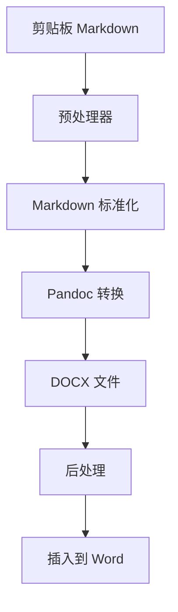

# Markdown 转换

PasteMD 的核心功能是将 Markdown 格式的文本转换为 Word/WPS 文档。

## 基本用法

### 1. 复制 Markdown 文本

从任何地方复制 Markdown 内容：

```markdown
# 标题一

这是一段**粗体**和*斜体*文本。

## 标题二

- 列表项 1
- 列表项 2
- 列表项 3

### 代码示例

\`\`\`python
def hello_world():
    print("Hello, World!")
\`\`\`

> 这是一个引用块
```

### 2. 触发转换

1. 打开 Word 或 WPS 文字
2. 定位光标到插入位置
3. 按下热键（默认 `Ctrl+Shift+B`）

### 3. 查看结果

内容自动插入，所有格式完美保留：

- ✅ 标题层级
- ✅ 粗体/斜体
- ✅ 列表（有序/无序）
- ✅ 代码块（带语法高亮）
- ✅ 引用块
- ✅ 链接
- ✅ 图片

## 支持的 Markdown 语法

### 标题

```markdown
# 一级标题
## 二级标题
### 三级标题
#### 四级标题
##### 五级标题
###### 六级标题
```

转换为 Word 的"标题 1" 到"标题 6"样式。

---

### 强调

```markdown
**粗体文本**
*斜体文本*
***粗斜体***
~~删除线~~
`行内代码`
```

- `**text**` → **粗体**
- `*text*` → *斜体*
- `~~text~~` → ~~删除线~~
- `` `code` `` → 灰色背景 + 等宽字体

---

### 列表

**无序列表**：
```markdown
- 项目 1
- 项目 2
  - 子项目 2.1
  - 子项目 2.2
- 项目 3
```

**有序列表**：
```markdown
1. 第一步
2. 第二步
3. 第三步
```

**任务列表**：
```markdown
- [x] 已完成
- [ ] 未完成
```

---

### 链接和图片

**链接**：
```markdown
[PasteMD GitHub](https://github.com/RichQAQ/PasteMD)
```

转换为可点击的超链接。

**图片**：
```markdown

```

图片会被下载并嵌入到文档中。

---

### 代码块

**单行代码**：
```markdown
使用 `print()` 函数输出。
```

**多行代码块**：
````markdown
```python
def factorial(n):
    if n <= 1:
        return 1
    return n * factorial(n - 1)
```
````

**语法高亮**：
支持 100+ 编程语言的语法高亮（如果使用了支持的 Pandoc 版本和参考模板）。

---

### 引用

```markdown
> 这是一个引用块。
> 可以包含多行。
>
> > 嵌套引用
```

---

### 表格

```markdown
| 列1 | 列2 | 列3 |
|-----|-----|-----|
| A   | B   | C   |
| D   | E   | F   |
```

::: tip
表格会根据当前应用自动选择转换方式：
- **Word/WPS 文字**：转换为 Word 表格
- **Excel/WPS 表格**：转换为工作表（保留格式）
:::

详见 [Excel 表格](/zh/guide/excel-tables)。

---

### 分隔线

```markdown
---
```

转换为水平线。

---

## 数学公式

PasteMD 完美支持 LaTeX 数学公式。详见 [数学公式](/zh/guide/math-formulas)。

---

## 高级语法

### 脚注

```markdown
这是文本[^1]。

[^1]: 这是脚注内容。
```

### 定义列表

```markdown
术语
: 定义内容
```

### 上标/下标

```markdown
H~2~O
x^2^
```

::: warning 注意
高级语法的支持取决于 Pandoc 的扩展选项。部分语法可能需要自定义过滤器。
:::

---

## HTML 嵌入

Markdown 中可以直接嵌入 HTML：

```markdown
这是 <span style="color: red;">红色文本</span>。

<div style="background: #f0f0f0; padding: 10px;">
自定义样式的块
</div>
```

::: tip
PasteMD 会保留大部分 HTML 标签的样式，但复杂的 CSS 可能不被完全支持。
:::

---

## 文件引用

PasteMD 支持从文件管理器复制 `.md` 文件：

1. 在文件管理器中选中一个或多个 `.md` 文件
2. 复制（`Ctrl+C`）
3. 打开 Word
4. 按热键

PasteMD 会：
- 读取所有文件内容
- 按文件名顺序合并
- 转换并插入

---

## 自定义样式

### 使用参考模板

在配置文件中指定参考 DOCX：

```json
{
  "reference_docx": "~/Documents/my-template.docx"
}
```

参考模板可以定义：
- 标题样式（字体、大小、颜色）
- 正文样式
- 代码块样式
- 列表样式
- 页面布局（页边距、页眉页脚）

**创建参考模板**：

1. 在 Word 中创建新文档
2. 修改样式（开始 → 样式 → 右键修改）：
   - 标题 1-6
   - 正文
   - 代码
   - 引用
3. 保存为 `.docx`

---

## 预处理器

PasteMD 在转换前会预处理 Markdown 内容：

### 标准化换行

修复不同平台的换行符差异（`\r\n` vs `\n`）。

### 规范化列表

修复列表缩进和标记不一致的问题。

### 首段缩进处理

根据 `md_disable_first_para_indent` 配置，自动处理首段缩进。

---

## 转换流程



**详细步骤**：

1. **读取剪贴板**：获取 Markdown 文本或文件路径
2. **预处理**：
   - 标准化换行符
   - 处理 LaTeX 公式
   - 修复常见语法问题
3. **Pandoc 转换**：
   - 调用 Pandoc CLI
   - 应用自定义过滤器
   - 使用参考模板
4. **后处理**：
   - 调整首段样式
   - 优化表格格式
5. **插入应用**：
   - Windows: COM 自动化
   - macOS: AppleScript 或剪贴板

---

## 常见问题

### 中文字符显示异常

**原因**：参考模板的字体不支持中文。

**解决**：
1. 在参考模板中设置支持中文的字体（如宋体、微软雅黑）
2. 或不使用参考模板（使用 Word 默认字体）

### 代码块没有语法高亮

**原因**：Pandoc 默认不生成语法高亮。

**解决**：
1. 使用 Pandoc 2.7.3+ 版本
2. 在参考模板中定义代码块样式
3. 或使用自定义过滤器（如 `pandoc-highlighting`）

### 列表缩进不正确

**原因**：参考模板的列表样式定义问题。

**解决**：
1. 在 Word 参考模板中调整列表样式
2. 设置正确的缩进和编号格式

### 图片无法显示

**原因**：
- 网络图片无法访问
- 图片格式不支持

**解决**：
1. 确保网络连接正常
2. 使用常见格式（JPG、PNG、GIF）
3. 或使用本地图片路径

---

## 下一步

- [HTML 富文本](/zh/guide/html-richtext) - 从网页复制内容
- [Excel 表格](/zh/guide/excel-tables) - 表格格式保留
- [数学公式](/zh/guide/math-formulas) - LaTeX 公式支持
- [自定义过滤器](/zh/guide/custom-filters) - 扩展功能
