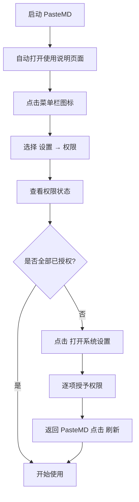

# macOS 权限设置

macOS 的安全机制要求应用获得用户明确授权才能访问某些系统功能。PasteMD 需要以下权限才能正常工作。

::: warning 重要
**所有权限都必须授予**，否则相应功能将无法使用。
:::

## 快速检查

### 通过设置界面检查

1. 点击菜单栏的 PasteMD 图标 📋
2. 选择"设置"
3. 切换到"权限"选项卡
4. 查看各项权限的状态
5. 点击"打开系统设置"快速跳转

### 通过系统设置检查

打开"系统设置" → "隐私与安全性"，检查以下项目：

- ✅ 辅助功能
- ✅ 屏幕录制（macOS 10.15+）
- ✅ 输入监控
- ✅ 自动化

## 权限详解

### 1. 辅助功能 (Accessibility)

<div class="info-card">
  <div class="info-card-icon">⌨️</div>
  <div class="info-card-content">
    <h4>用途</h4>
    <p>模拟键盘输入，用于 WPS 的自动粘贴（Cmd+V）</p>
  </div>
</div>

**必需性**：⚠️ **条件必需** - 如果使用 WPS，必须授权；仅使用 Office 可不授权

**设置步骤**：

1. 打开"系统设置" → "隐私与安全性"
2. 点击"辅助功能"
3. 点击左下角的锁图标 🔒 解锁（需要输入密码）
4. 找到"PasteMD"并勾选
5. 如果没有看到 PasteMD，点击 ➕ 按钮手动添加：
   - 按 `Cmd+Shift+G` 打开"前往文件夹"
   - 输入 `/Applications/PasteMD.app`
   - 点击"打开"
6. 重启 PasteMD

**验证**：
- 打开 WPS 文字或 WPS 表格
- 复制一段 Markdown 文本
- 按热键 `Ctrl+Shift+B`
- 内容应该自动粘贴到 WPS

---

### 2. 屏幕录制 (Screen Recording)

<div class="info-card">
  <div class="info-card-icon">🖥️</div>
  <div class="info-card-content">
    <h4>用途</h4>
    <p>检测前台窗口和应用名称，判断当前是 Word/Excel/WPS</p>
  </div>
</div>

**必需性**：✅ **必需**（macOS 10.15+）- 没有此权限无法自动识别应用

**适用系统**：macOS 10.15 Catalina 及以上版本

**设置步骤**：

1. 打开"系统设置" → "隐私与安全性"
2. 点击"屏幕录制"
3. 点击左下角的锁图标 🔒 解锁
4. 找到"PasteMD"并勾选
5. 点击"稍后"或"现在退出"（建议退出并重启）

::: tip 说明
虽然叫"屏幕录制"，但 PasteMD **不会录制你的屏幕**，只是利用这个权限获取窗口信息。
:::

**验证**：
- 打开 Word 或 Excel
- 查看 PasteMD 日志（菜单栏 → "查看日志"）
- 应该能看到检测到的应用名称

---

### 3. 输入监控 (Input Monitoring)

<div class="info-card">
  <div class="info-card-icon">⌨️</div>
  <div class="info-card-content">
    <h4>用途</h4>
    <p>监听全局热键，响应 Ctrl+Shift+B 等快捷键</p>
  </div>
</div>

**必需性**：✅ **必需** - 没有此权限热键将完全无法工作

**设置步骤**：

1. 打开"系统设置" → "隐私与安全性"
2. 点击"输入监控"
3. 点击左下角的锁图标 🔒 解锁
4. 找到"PasteMD"并勾选
5. 重启 PasteMD

**验证**：
- 打开任意应用
- 按下热键 `Ctrl+Shift+B`
- 如果有通知弹出，说明权限已生效

---

### 4. 自动化 (Automation)

<div class="info-card">
  <div class="info-card-icon">🤖</div>
  <div class="info-card-content">
    <h4>用途</h4>
    <p>通过 AppleScript 控制 Microsoft Word/Excel，实现精确插入</p>
  </div>
</div>

**必需性**：⚠️ **条件必需** - 如果使用 Office，必须授权；仅使用 WPS 可不授权

**设置步骤**：

1. 打开"系统设置" → "隐私与安全性"
2. 点击"自动化"
3. 找到"PasteMD"并展开
4. 勾选以下项目（只有实际使用后才会出现）：
   - ✅ Microsoft Word
   - ✅ Microsoft Excel

::: tip 首次触发
这个权限通常在你**首次向 Word/Excel 插入内容时**自动弹出授权对话框。如果不小心拒绝了，需要手动到系统设置中开启。
:::

**验证**：
- 打开 Microsoft Word
- 复制一段 Markdown 文本
- 按热键 `Ctrl+Shift+B`
- 内容应该自动插入到光标位置

---

## 权限授予流程

### 首次启动流程



### 推荐顺序

建议按以下顺序授予权限：

1. **输入监控** - 最重要，确保热键工作
2. **屏幕录制** - 其次重要，确保应用检测
3. **辅助功能** - 如果使用 WPS
4. **自动化** - 在首次向 Office 插入内容时自动触发

## 常见问题

### 已授权但仍不工作

**解决方法**：

1. **完全退出 PasteMD**：
   - 点击菜单栏图标 → "退出"
   - 或在"活动监视器"中强制退出

2. **重新启动 PasteMD**：
   - 从 Applications 文件夹启动
   - 或从启动台启动

3. **刷新权限状态**：
   - 设置 → 权限 → 点击"刷新"

4. **检查系统设置**：
   - 确保 PasteMD 在系统设置中确实已勾选

### 找不到 PasteMD

在系统设置的权限列表中找不到 PasteMD。

**解决方法**：

1. **确认 PasteMD 已运行**：权限列表只显示已请求权限的应用
2. **手动触发权限请求**：
   - 启动 PasteMD
   - 尝试使用功能（按热键）
   - 系统会弹出授权对话框
3. **手动添加**（仅适用于部分权限）：
   - 系统设置 → 隐私与安全性 → 对应权限
   - 点击 ➕ 按钮
   - 选择 `/Applications/PasteMD.app`

## 安全性说明

### PasteMD 如何使用权限

- **辅助功能**：仅用于模拟 `Cmd+V` 粘贴，不记录你的输入
- **屏幕录制**：仅读取前台窗口信息（应用名称和窗口标题），不截图或录屏
- **输入监控**：仅用于监听你设置的热键，不监听其他按键
- **自动化**：仅在你按下热键时执行 AppleScript，不会后台操作应用

### 隐私保护

- ✅ PasteMD 是开源软件，代码公开透明
- ✅ 所有操作在本地完成，不联网
- ✅ 不收集任何用户数据
- ✅ 不访问非必要的系统资源

### 审计日志

所有操作都会记录在日志文件中，你可以随时查看：

- 菜单栏 → "查看日志"
- 或打开 `~/Library/Logs/PasteMD/pastemd.log`

## 故障排查

### 诊断脚本

你可以运行以下命令检查权限状态：

```bash
# 检查辅助功能权限
sqlite3 ~/Library/Application\ Support/com.apple.TCC/TCC.db \
  "SELECT * FROM access WHERE client='com.richqaq.pastemd'"

# 查看所有与 PasteMD 相关的权限
tccutil list | grep pastemd
```

### 详细日志

如果遇到问题，可以开启详细日志：

1. 编辑配置文件（菜单栏 → "编辑配置文件"）
2. 添加或修改：
   ```json
   {
     "log_level": "DEBUG"
   }
   ```
3. 重载配置（菜单栏 → "重载配置"）
4. 重现问题
5. 查看日志（菜单栏 → "查看日志"）

## 更多帮助

如果权限设置仍有问题：

- [GitHub Issues](https://github.com/RichQAQ/PasteMD/issues)
- [在线使用说明](https://pastemd.richqaq.cn/macos)
